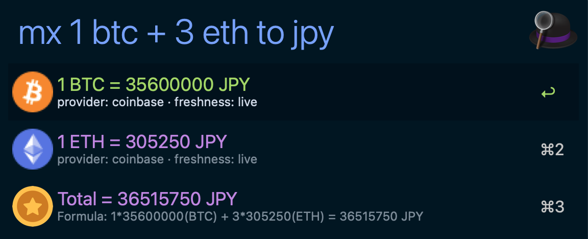

# Market Expression - Alfred Workflow

Evaluate market expressions and show favorite market symbols when the query is empty.

## Screenshot

## Features

- Trigger with `mx` for a prompt row on empty query, with optional favorite quotes when enabled, or `mx <expression>` for evaluation.
- Empty query always shows a prompt row first.
  When favorites are enabled, it then shows favorite symbols converted into the configured
  default fiat as non-selectable rows.
- Calls `market-cli expr --query <query> --default-fiat <MARKET_DEFAULT_FIAT>`.
- Calls `market-cli favorites --list <MARKET_FAVORITE_LIST> --default-fiat <MARKET_DEFAULT_FIAT>` for empty query only when favorites are enabled.
- Supports `+ - * /` for numeric-only expressions and `+ -` for asset expressions, with target fiat syntax `to <FIAT>`
  (default `USD`).
- Accepts compact asset terms like `1btc` and `3eth` (auto-normalized).
- Enter on a row copies the selected payload via `pbcopy`.
- Supports local binary override via `MARKET_CLI_BIN` for debugging.
- Friendly validation messages for common expression mistakes.

## Configuration

Set these via Alfred's "Configure Workflow..." UI:

| Variable | Required | Default | Description |
| --- | --- | --- | --- |
| `MARKET_CLI_BIN` | No | (empty) | Optional absolute path override for `market-cli`. |
| `MARKET_DEFAULT_FIAT` | No | `USD` | Default fiat passed to `market-cli expr --default-fiat` when query omits fiat target. |
| `MARKET_FX_CACHE_TTL` | No | (empty) | Optional FX cache TTL. Supports `1s`, `1m`, `1h`, `1d`; empty keeps the built-in `1d` default. |
| `MARKET_CRYPTO_CACHE_TTL` | No | (empty) | Optional crypto cache TTL. Supports `1s`, `1m`, `1h`, `1d`; empty keeps the built-in `5m` default. |
| `MARKET_FAVORITES_ENABLED` | No | `1` | Toggle empty-query favorite quote rows. Use `0`/`false`/`off` to keep only the prompt row. |
| `MARKET_FAVORITE_LIST` | No | `BTC,ETH,EUR,JPY` | Ordered comma/newline favorites list used for empty query. |

Empty or delimiter-only `MARKET_FAVORITE_LIST` input falls back to
`BTC,ETH,<MARKET_DEFAULT_FIAT>,JPY`.

## Query Behavior

| Query | Behavior |
| ----- | -------- |
| `mx` | Show a non-selectable prompt row. If `MARKET_FAVORITES_ENABLED` is on, append favorite quote rows from `MARKET_FAVORITE_LIST`. Duplicates are removed after first occurrence; empty or delimiter-only config falls back to `BTC,ETH,<MARKET_DEFAULT_FIAT>,JPY`. |
| `mx <expression>` | Evaluate the expression through `market-cli expr` and return actionable result rows. |

Favorite quote rows render `1 <SYMBOL> = <PRICE> <MARKET_DEFAULT_FIAT>` when pricing
succeeds. If a symbol cannot be priced, that row falls back to a non-selectable
symbol hint so the empty-query page still renders.

## Keyword

| Keyword | Behavior |
| --- | --- |
| `mx <expression>` | Evaluate expression and show Alfred rows from `market-cli expr`. |
| `mx` | Show a prompt row, plus non-selectable favorite quote rows when enabled. |

## Validation

- `bash workflows/market-expression/tests/smoke.sh`
- `scripts/workflow-test.sh --id market-expression`
- `scripts/workflow-pack.sh --id market-expression`

## Optional live smoke (maintainer)

- `bash scripts/market-cli-live-smoke.sh`
- This live check is optional maintainer validation for provider freshness/contract behavior.
- It is not required for commit gates or CI pass/fail.

## Troubleshooting

See [TROUBLESHOOTING.md](./TROUBLESHOOTING.md).
