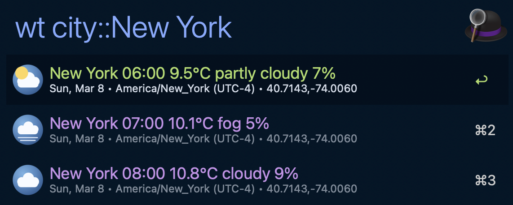

# Weather Forecast - Alfred Workflow

Show no-token weather forecasts from `weather-cli`, with `wt` for today/hourly flow and `ww` for city-pick/week flow.

## Screenshot

## Keywords

| Keyword | Behavior |
| --- | --- |
| `wt` | Show today rows first, then select a row to open hourly forecast. |
| `ww` | Pick city, then show 7-day forecast. |

## Query Format

- City name: `wt Taipei`
- Multi-city by comma: `wt Tokyo,Osaka,Taipei`
- Coordinates: `wt 25.03,121.56`
- Today view is two-stage:
  1. `wt <query>` shows current-day daily rows.
  2. Select a daily row to show hourly rows for that city.
- Week view is two-stage:
  1. `ww <query>` to pick a city.
  2. Select a city row to show fixed 7-day forecast rows.
- Empty query uses `WEATHER_DEFAULT_CITIES`.

## Workflow Variables

Set these via Alfred's `Configure Workflow...` UI:

| Variable | Required | Default | Description |
| --- | --- | --- | --- |
| `WEATHER_CLI_BIN` | No | `(empty)` | Optional executable path override for `weather-cli`. |
| `WEATHER_LOCALE` | No | `en` | Output locale for weather labels (`en` default, `zh` optional). |
| `WEATHER_DEFAULT_CITIES` | No | `Tokyo` | Default city list when query is empty (comma-separated). |
| `WEATHER_CACHE_TTL_SECS` | No | `900` | Cache TTL in seconds for weather responses (15 minutes). |

## Notes

- `wt` stage-one row format: `City min~max°C Summary x%`.
- `wt` stage-two row format: `City HH:MM Temp°C Summary x%`.
- `ww` stage-one rows are city-picker items; `ww` stage-two rows use `City min~max°C Summary x%`.
- Subtitle shows `Thu, Feb 12 • Asia/Taipei (UTC+8) • 25.0330,121.5654` style separators for English output.
- Result rows consume `weather-cli` icon metadata and render PNG assets under `assets/icons/weather/*.png`.
- Editable SVG source lives under `assets-src/icons/weather/*.svg`;
  `scripts/generate_weather_icons.sh` converts every source SVG to runtime PNG via
  `image-processing`.
- `wt` current-city rows use the city's current local time to select `*-day` / `*-night`
  variants; hourly rows use each row's local hour, so night rows now keep the same weather
  glyph with a darker night background and moon variants where applicable.
- `wt` stage-one autocomplete now uses `city::<location>` instead of embedding coordinates in
  the visible query; when a cached geocoding result exists, the script reuses cached
  coordinates before fetching hourly rows.
- `wt` multi-city stage-one no longer loops over `weather-cli` once per city in shell; it forwards
  repeated `--city` flags to `weather-cli`, which resolves uncached geocoding misses in parallel
  and batches the Open-Meteo daily forecast call in Rust.
- `wt` keeps original today-row display as stage one, then opens hourly rows as stage two.
- `ww` uses city-picker stage first, then returns fixed 7-day rows for the selected city.
- `weather-cli --output alfred-json` is the runtime contract used by the workflow. Single-city
  outputs are normalized in shell; batch daily outputs are already flattened by Rust.
- `jq` is still recommended for local validation and shell-side normalization/token rewriting, but
  Rust now owns multi-city daily batching and icon selection.
- Cache TTL is configurable via `WEATHER_CACHE_TTL_SECS` (`900` by default in workflow).
- Enter on result rows copies the selected row argument.
- The workflow calls `weather-cli` with `--output alfred-json --lang <locale>`:
  `today` for `wt` stage one, `hourly` for `wt` stage two, and `week` for `ww` stage two.

## Local Validation

- `bash workflows/weather/tests/smoke.sh`
  Includes targeted markdownlint checks for weather-related docs.
- `scripts/workflow-test.sh --id weather`
- `scripts/workflow-pack.sh --id weather`

## Optional live smoke (maintainer)

- `bash scripts/weather-cli-live-smoke.sh`
- This live check is optional maintainer validation for provider/fallback/contract behavior.
- It is not required for commit gates or CI pass/fail.

## Troubleshooting

See [TROUBLESHOOTING.md](./TROUBLESHOOTING.md).
